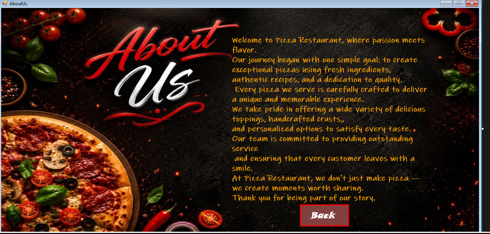

# 🍕 Pizza Order System

A desktop application built using C# and Windows Forms that allows users to customize their pizza and place an order through a simple, interactive, and user-friendly interface.

---

# 📸 Project Preview

## Main Interface

---

## Order Summary

---

# ✨ Features

- 🍕 Select Pizza Size (Small, Medium, Large)
- 🥖 Choose Crust Type (Thin Crust or Thick Crust)
- 🧀 Add Multiple Toppings
- 🏠 Choose Eat In or Take Out
- 💰 Automatic Price Calculation
- 📋 Display Complete Order Summary
- 🔄 Reset Order
- 🖥️ Clean and Easy-to-Use Interface

---

# 🛠 Technologies Used

- C#
- Windows Forms (.NET Framework)
- Visual Studio

---

# 📚 Windows Forms Controls Used

- Form
- Label
- Button
- GroupBox
- RadioButton
- CheckBox
- PictureBox
- Panel
- MessageBox

---

# 🧠 Programming Concepts Practiced

- Event Handling
- Methods
- Variables
- Conditional Statements (if)
- Using the Tag Property
- Price Calculation Logic
- Desktop Application Development
- User Interface Design

---

# ⚙️ How It Works

1. Select the pizza size.
2. Select the crust type.
3. Choose your favorite toppings.
4. Select Eat In or Take Out.
5. The application calculates the total price automatically.
6. Click Order to display the order summary.
7. Click Reset to clear all selections.

---

# 🚀 Future Improvements

- Save orders to a database.
- Print order receipts.
- Add customer information.
- Improve the UI.
- Add more pizza types.
- Support multiple languages.

---

# 👨‍💻 Author

Saied Nasef

Student | Learning C#, SQL Server, OOP, Algorithms & Data Structures.

---

